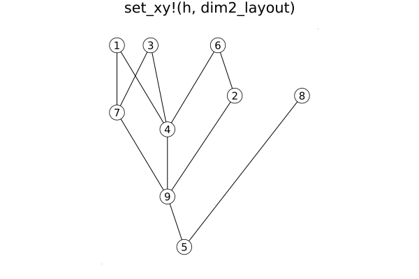
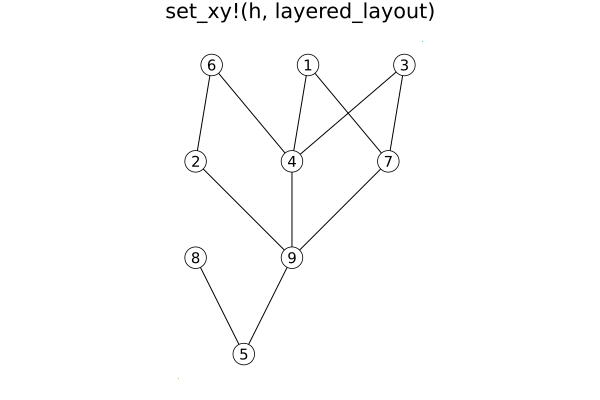

# HasseDiagrams

Drawings of [Posets](https://github.com/scheinerman/Posets.jl) (partially ordered sets).

## Basic Usage

```
julia> p = subset_lattice(3)
{8, 19} Int64 poset

julia> h = HasseDiagram(p)
Hasse diagram of a {8, 19} Int64 poset

julia> draw(h)
```

## Creating a Layout

When a Hasse diagram is created, it is given a default layout. Hasse diagrams can be given an alternative layout with the function `set_xy!`. There are two forms:

* `set_xy!(h, method)` uses the function `method` to compute the layout. The function acts on the posets held inside `h`. The list of available layout methods is in the next section. 
* `set_xy!(h, xy)` uses the dictionary `xy` to site the vertices. Vertex `v` is placed at `xy[v]`. If `v` is not a key of `xy`, then its location is unchanged.

### Scaling

The function `scale!(p,μ)` multiplies all coordinates in the embedding by `μ`. 
It is likely more useful just to multiply the `x`- or `y`-coordinates; 
to do so, use `scalex!` or `scaley!`, respecitvely. 

## Layout Methods

* `basic_layout` places vertices vertically based on their rank and, within each rank, the horizontal placement is evenly spaced.
* `dim2_layout` is a decent layout function that is applicable to posets whose dimension is at most two. Reasonbly quick. If the poset has dimension greater than two, a reasonable alternative is presented. 
* `layered_layout` is a Sugiyaqma style layout from the [LayeredLayouts](https://github.com/oxinabox/LayeredLayouts.jl) module. Can be slow. 


## Sample Results
Results for a randomly generated two-dimensional poset:







## Properties

#### Font size

* Use `set_font_size!(h, sz)` to set labels to be `sz` points. Use `0` to hide labels. Default is `FONT_SIZE = 10`.
* Use `get_font_size(h)` to determine the current font size for `h`. 

#### Node radius

* Use `set_radius!(h, r)` to set the size of the circles that represent the elements of the poset. Default is `RADIUS = 12`.
* Use `get_radius(h)` to determine the current radius.

#### Fill color

* Use `set_fill_color!(h, c)` to set the fill color for the circles to `c`. Default is `FILL_COLOR = :white`. All circles are filled with the same color. 
* Use `get_fill_color(h)` to determine the current color. 


## Example

Here is an example for drawing (small) subset lattices with sensible labels. Here is the function
to produce the picture:

```julia
using Posets, HasseDiagrams, SimpleDrawing, ShowSet

function draw_bool(k)
    p = subset_lattice(k)
    h = HasseDiagram(p)
    labs = Dict{Int,String}()
    for v in 1:nv(p)
        labs[v] = string(subset_decode(v))
    end
    set_labels!(h, labs)
    set_font_size!(h, 8)
    set_radius!(h, 30)
    set_fill_color!(h, :lightblue)
    set_xy!(h, layered_layout)
    draw(h)
    expand_canvas()  # from SimpleDrawing
end
```
Here is the result of `draw_bool(4)`:

